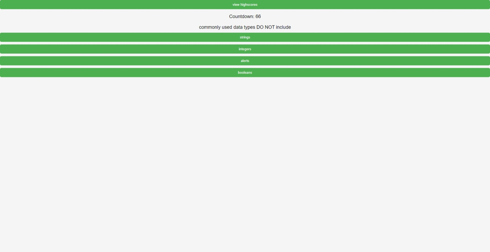

# Code Quiz Application

## Description

The Code Quiz application is a fun way for users to test their coding knowledge through a timed quiz. It presents questions one by one, deducts time for incorrect answers, and allows users to save their initials and scores at the end of the quiz.

## Features

Start button to begin the quiz and start the timer
Timer that counts down as users progress through the quiz
Question presentation one by one
Answer validation and scoring system
Deduction of time for incorrect answers
Game over condition when all questions are answered or the timer reaches 0
Save initials and score at the end of the game

## Installation

N/A

## Usage

Open the index.html file in your web browser.
Click the Start button to begin the quiz.
The timer will start, and you will be presented with a question.
Answer the question by selecting the correct option.
If you answer incorrectly, time will be deducted from the timer.
Proceed through all the questions within the given time limit.
When all questions are answered or the timer reaches 0, the game is over.
Enter your initials and save your score at the end of the game.
Screenshots
Include screenshots of the Code Quiz interface showing questions, timer, and the end screen where initials and scores are saved.

## Technologies Used

HTML/CSS
JavaScript
Local Storage

## Credits

This project was created by Matheus Almeida.

## License

N/A

